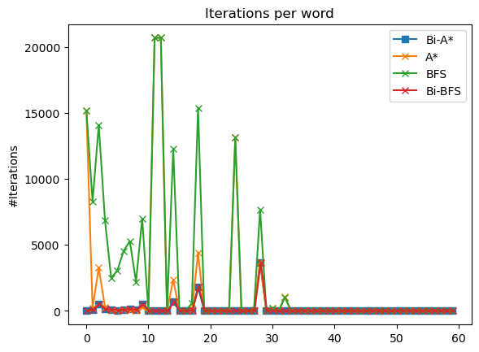

# Word Ladder Problem

> Suhas | 2024

## Description

Intended to solve the word ladder problem in different ways.
Read the report [here](Report-2/Report.pdf).

### Steps

1. Gather data
    - [GitHub](https://github.com/dwyl/english-words)
    - [Wordnet](https://wordnet.princeton.edu/) (thru NLTK)
2. Run algorithms
    - A*
    - Bi-A*
    - BFS
    - Bi-BFS

### Results

- Histogram

- Iterations vs index (benchmark)

- Length of the word chain obtained

A little off to see BFS outperform all other algorithms.